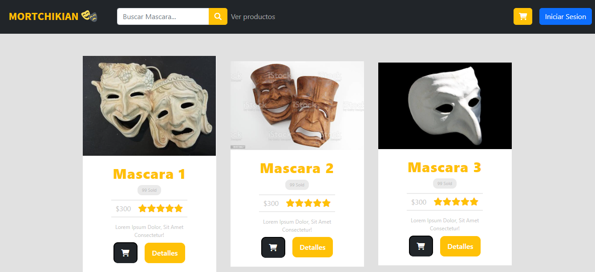
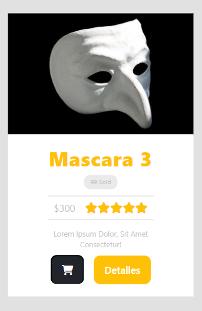
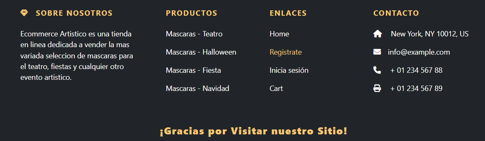
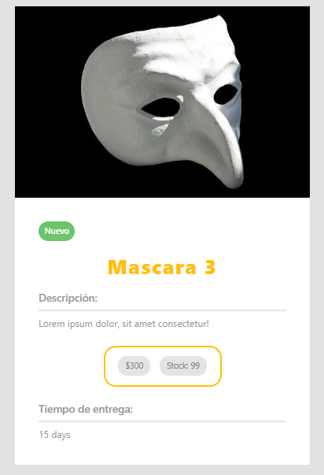
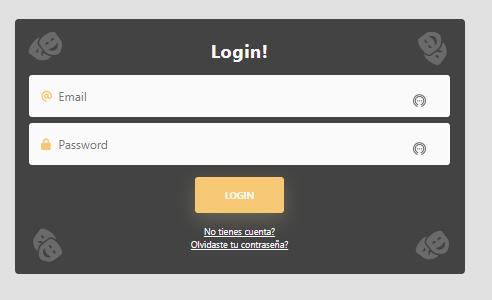
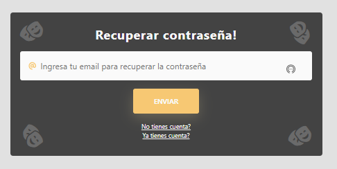

# C8-41-T-MERN

<div align="center">
  
</div>

<h3 align="center">
    Ecommerce del equipo C8-41 usando el stack MERN 💻🚀
</h3>

<p align="center">
  <a href="#about-the-project">About The Project</a> |
  <a href="#layout">Layout</a> |
  <a href="#technologies">Technologies</a> |
  <a href="#contribution">Contribution</a> |
  <a href="#authors">Author</a> |
  <a href="#license">License</a>
</p>

</br>

---

<h4 align="center">
	🚧 Status: Building 🚀  🚧

  <p align="center"> c8-41-t-mern.vercel.app </p>

</h4>

---

</br>

<h2 id="about-the-project" > ⏰📈 About The Project </h2>

**Ecommerce** developed by the **C8-41-t-mern** team using the **MERN** stack as part of **Cohorte 8**, a work environment simulator sponsored by **No Country**.

### Introduction

Mortchikian is a company dedicated to the manufacture and distribution of masks, their price varies according to the design and the material used. Despite being known and recommended by his customers, Mortchikian wants to extend his reach and offer his products to potential customers around the world at a low cost and thus increase his profits, but how could he do it?

### Project Justification

This project aims to provide Mortchikian with a technological boost so that its products have greater reach and visibility; its masks can be purchased by current and new customers; maximizing its sales at a lower cost and guaranteeing customer satisfaction from the moment they enter the platform until the delivery of the product.

### Project Objective

1. To develop for Mortchikian a platform for the sale of masks.
2. To support Mortchikian in reaching more people with their products.
3. Create a platform that maximizes mask sales at a low cost.
4. Design a platform that guarantees customer satisfaction.

### Features

This project features:

1. **CRUD** for _products, orders_ and _users_.
2. **Routes** for _users, login, products, orders_ and _shopping cart_.
3. **Validations** for _users, products_ and _orders_.
4. **Roles** for _customer_ and _administrator_ users.
5. **Cards** to display each \*product\*\*.
6. **Password recovery**.
7. **Error handling** and more.

## Next features:

- [ ] ;

---

## 🚀 Getting Started

### FRONTEND

First, run the development server:

```bash
# Clone Repository
$ git clone https://github.com/No-Country/C8-41-t-mern.git
# Go to a specific folder
$ cd client
# Install Dependencies
$ npm i
# Run Aplication with ViteJS
$ npm run dev
```

### BACKEND

First, run the development server:

```bash
# Clone Repository
$ git clone https://github.com/No-Country/C8-41-t-mern.git
# Install Dependencies
$ npm i
# Create .env for Environment Variables.
$ cp .env.example .env
# Configure the .env with your Connection Data.
  DB_NAME=
  PORT=
  SECRETORPRIVATEKEY=
  ACCESS_TOKEN=
# Run Aplication
$ npm start
```

---

<h2 id="layout" >🎨  Layout </h2>

The ecommerce preview:

**NOTE:** In each image, there will be a short review of how the process was to build the result seen.

---

### Home



---

### NavBar


---

### Single Card



---

### Footer



---

### Product Detail



---

### Register


---

### Login



---

### Password recovery



---

<h2 id="technologies"> 🛠 Technologies </h2>

The following tools were used in the construction of the project:

- **[ReactJS](https://reactjs.org)**
- **[Javascript](https://www.javascript.com/)**
- **[Redux](https://redux.js.org/)**
- **[Axios](https://github.com/axios/axios)**
- **[ViteJS](https://vitejs.dev/)**
- **[NodeJS](https://nodejs.org/en/)**
- **[ExpressJS](https://expressjs.com/)**
- **[MongoBD](https://www.mongodb.com/)**
- **[Bootstrap](https://getbootstrap.com/)**

---

<h2 id="contribution"> 💪 Contribution </h2>

Contributions are what make the open source community such an amazing place to be learn, inspire, and create. Any contributions you make are **greatly appreciated**.

1. Fork the Project
2. Create your Feature Branch (`git checkout -b feature/AmazingFeature`)
3. Commit your Changes (`git commit -m 'Add some AmazingFeature'`)
4. Push to the Branch (`git push origin feature/AmazingFeature`)
5. Open a Pull Request

---

<h2 id="authors"> 💻 Authors </h2>

|                                                                                                                                                                                                                                                                                                                              |
| :----------------------------------------------------------------------------------------------------------------------------------------------------------------------------------------------------------------------------------------------------------------------------------------------------------------------------------------------------------------------------------------------------: | --- |
|                                                                                                                                                                                            Fausto Centurion                                                                                                                                                                                            |
|       <a target="_blank" href="https://github.com/Fgc1997"></a> <a target="_blank" href="https://www.linkedin.com/in/fausto-centuri%C3%B3n-084b46219/"></a>       |
|                                                                                                                                                                                                                                                                                                                               |
|                                                                                                                                                                                            Hristo S. Oviedo                                                                                                                                                                                            |
|               <a target="_blank" href="https://github.com/hristoviedo"></a> <a target="_blank" href="https://www.linkedin.com/in/hristoviedo/"></a>               |     |
|                                                                                                                                                                                                                                                                                                                                                   |
|                                                                                                                                                                                         José Andrés Gavilanes                                                                                                                                                                                          |
| <a target="_blank" href="https://github.com/joseandresgavilanes"></a> <a target="_blank" href="https://www.linkedin.com/in/jose-andres-gavilanes-2954691b5/"></a> |     |
|                                                                                                                                                                                                                                                                                                                               |
|                                                                                                                                                                                            Miguel Guerrero                                                                                                                                                                                             |
|           <a target="_blank" href="https://github.com/Eiine"></a> <a target="_blank" href="https://www.linkedin.com/in/miguel-guerrero-403939194/"></a>           |     |
|                                                                                                                                                                                                                                                                                                                               |
|                                                                                                                                                                                              Rafael León                                                                                                                                                                                               |
|                  <a target="_blank" href="https://github.com/rafa2701"></a> <a target="_blank" href="https://www.linkedin.com/in/rafa2701/"></a>                  |     |
|                                                                                                                                                                                                                                                                                                                               |
|                                                                                                                                                                                             Sergio Calbiño                                                                                                                                                                                             |
|             <a target="_blank" href="https://github.com/SergioCalbino"></a> <a target="_blank" href="https://www.linkedin.com/in/sergio-oscar/"></a>              |     |
|                                                                                                                                                                                                                                                                                                                               |
|                                                                                                                                                                                              Yohan Bello                                                                                                                                                                                               |
|                                  <a target="_blank" href="https://github.com/yohanolmedo"></a> <a target="_blank" href="#"></a>                                   |     |

---

<h2 id="license"> 📝 License </h2>
This project is under the [MIT](./LICENSE) license.
